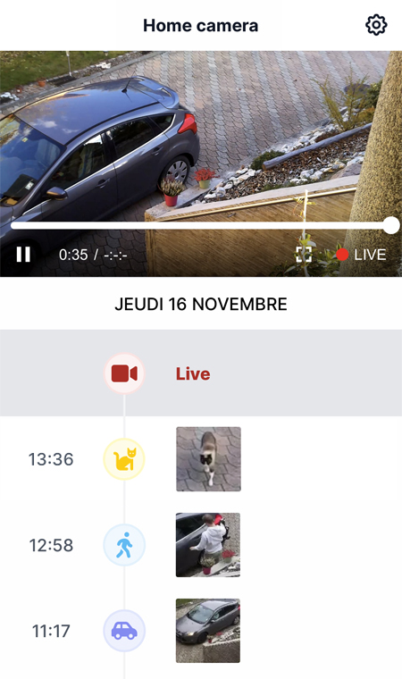

 

#

    <strong>PiSentry WebApp is a Next.js PWA for accessing security camera services offered by PiSentry Camera Software from anywhere in the world 📸🌍</strong>

    

 
 

## Table of Contents

1. [Run the app](#run-app)
2. [Technologies](#technologies)
3. [License](#license)

## Run the app

#### 1. Set correct URLs

Because the web app interacts with other PiSentry projects (the backend API
and the media server), you might want to check their URLs in `src/urls.js` and adapt them if necessary. 

#### 2. HTTPS support _(optional)_

HTTPS enables support for features such as push notifications, installable PWA, etc.

To be able to run the app in HTTPS, simply create a `.env` file based on `.env.example` and set your own correct values for the HTTPS env variables.
The paths to the files provided in `HTTPS_KEY` and `HTTPS_CERT` variables are always resolved from the `https_certificates/` directory. Place your HTTPS certificates in this directory.

If you need to generate self-signed HTTPS certificates, you can use [mkcert](https://github.com/FiloSottile/mkcert).

If HTTPS was set up properly, you will see the HTTPS server started in the console logs when running the app.

#### 3. Run the app

There are 3 different ways to run the application, depending on what you want to achieve:
1. To develop the app: Execute `npm run dev` and the Next.js development server will start.
2. To develop the app **with HTTPS support**: Execute `npm run httpsdev` and the custom HTTPS dev server will start. 
3. To run the app in production: Execute `npm run build` to statically build the app, then `npm start` to start the build, or `pm2 start pm2.config.cjs` to let pm2 manage it for you (you need to have pm2 installed).  

## Technologies

The web app has been developed with Next.js.

The main libraries used are :
- [Video.js](https://videojs.com/) - for playback of recordings and live streams
- [Redux Toolkit](https://redux-toolkit.js.org/) - for state management on the client
- [SWR](https://swr.vercel.app/) - for data fetching
- [Tailwind CSS](https://tailwindcss.com/) - for designing the user interface
- [React Splide](https://splidejs.com/integration/react-splide/) - for displaying multiple cameras in a slider/carousel

## License

This project is licensed under the MIT License
